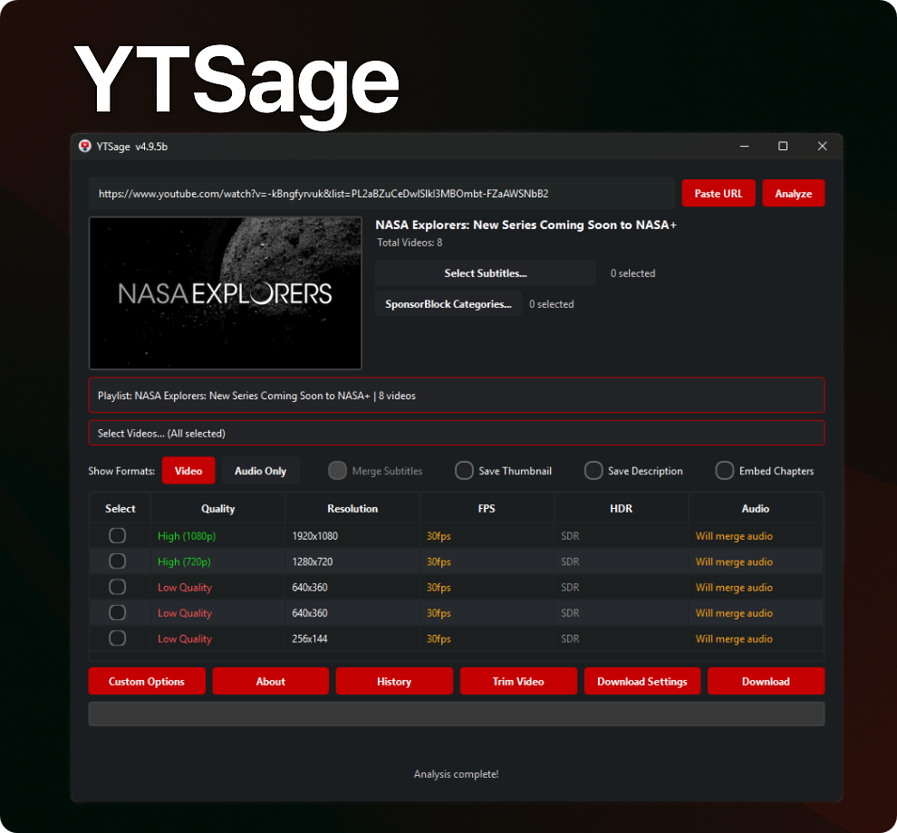
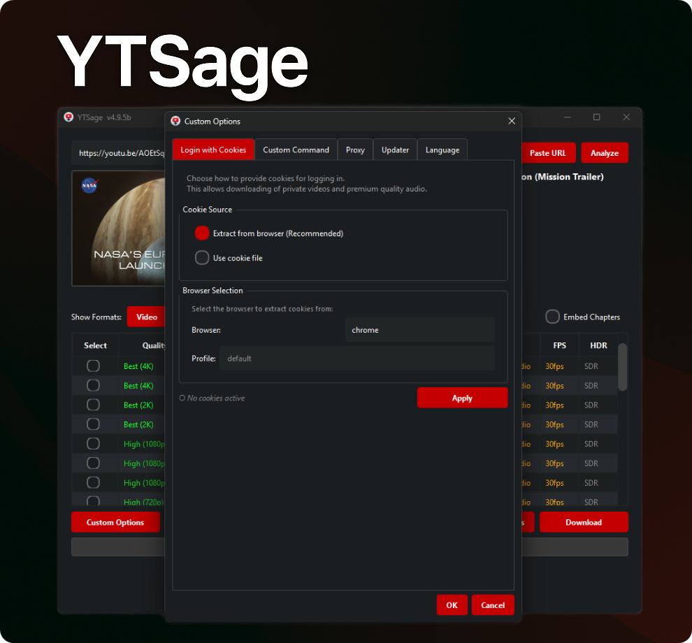

<div align="center">


[](https://www.python.org/downloads/)
[](https://pepy.tech/project/ytsage)
[](https://github.com/oop7/YTSage/releases)
[](https://opensource.org/licenses/MIT)
[](https://github.com/oop7/YTSage/releases)
[](https://github.com/oop7/YTSage/stargazers)
[](https://pypi.org/project/ytsage/)
[](https://github.com/sponsors/oop7)

**Um downloader moderno do YouTube com uma interface PySide6 limpa.**  
Baixe vídeos em qualquer qualidade, extraia áudio, busque legendas e muito mais.

### 🌍 LEIA-ME Idiomas

Inglês: [EN](../README.md)
| Nome: [AR](README.ar.md)
| Alemão: [DE](README.de.md)
| Espanhol: [ES](README.es.md)
| Francês: [FR](README.fr.md)
| Nome: [HI](README.hi.md)
| Bahasa Indonésia: [ID](README.id.md)
| Italiano: [IT](README.it.md)
| Nome do usuário: [JA](README.ja.md)
| Polaco: [PL](README.pl.md)
| Português: [PT](README.pt.md)
| Russo: [RU](README.ru.md)
| Turco: [TR](README.tr.md)
| 中文: [ZH](README.zh.md)

<p align="center">
  <a href="#installation">Instalação</a> •
  <a href="#features">Recursos</a> •
  <a href="#usage">Uso</a> •
  <a href="#screenshots">Capturas de tela</a> •
  <a href="#troubleshooting">Solução de problemas</a> •
  <a href="#sponsor">Patrocinador</a> •
  <a href="#contributing">Contribuindo</a>
</p>

</div>

---

<a id="why-ytsage"></a>
## ❓ Por que YTSage?

YTSage foi projetado para usuários que desejam um **baixador de YouTube simples, mas poderoso**. Ao contrário de outras ferramentas, oferece:

- Uma interface PySide6 limpa e moderna
- Downloads com um clique para vídeo, áudio e legendas
- Recursos avançados como SponsorBlock, mesclagem de legendas e seleção de playlist
- Modo genérico opcional para sites compatíveis com yt-dlp além do YouTube
- Suporte multiplataforma e fácil instalação

<a id="features"></a>
## ✨ Recursos

<div align="center">

| Recursos principais | Recursos Avançados | Recursos extras |
|-----------------------------------|---------------------------------------------------|-----------------------------------|
| 🎥 Tabela de Formatos | 🚫 Integração SponsorBlock | 🎞️ Tela FPS/HDR |
| 🎵 Extração de Áudio | 📝 Seleção e mesclagem de múltiplas legendas | 🔄 Atualização automática do yt-dlp |
| ✨ UI simples |  💾 Salvar descrição e miniatura | 🛠️ Detecção de FFmpeg/yt-dlp/Deno |
| 📋 Suporte e seletor de lista de reprodução | 🚀 Limitador de velocidade | ⚙️ Comandos personalizados |
| 📑 Incorporar capítulos | ✂️ Cortar seções de vídeo | 🍪 Login com Cookies |
| 📜 Histórico de downloads | 🔄 Seleção de canal de lançamento | 🌐 Suporte a proxy |
| 🎚️ Conversão de formato de áudio | 🎬 Configurações de formato de vídeo | 🆙 Guia Atualizador integrado |
| 🌍 Modo Genérico |
| 🌍 Localização em 14 idiomas |                                  |
</div>

<a id="installation"></a>
## 🚀 Instalação

### ⚡ Instalação rápida (recomendado)

Instale YTSage do PyPI:

```bash
pip install ytsage
```

<details>
<summary>🔄 Atualizar uma instalação existente</summary>

```bash
pip install --upgrade ytsage
```

</details>

Em seguida, inicie o aplicativo:

```bash
ytsage
```

### 📦 Executáveis pré-construídos

> [👉 Download Latest Release](https://github.com/oop7/YTSage/releases/latest)

#### 🪟 Janelas

| Formato | Descrição |
|--------|------------|
|  | Instalador padrão |
|  | Com FFmpeg incluído |
|  | Versão portátil, sem necessidade de instalação |
|  | Portátil com FFmpeg, compactado |

<details>
<summary>🛠️ Etapas de instalação</summary>

1. **EXE Installer (`.exe`)**: Clique duas vezes no arquivo e siga o assistente de configuração.
2. **Versão portátil (`.zip`)**: Extraia o arquivo para o local desejado e execute `ytsage.exe`.
3. **FFmpeg Bundled**: Escolha as versões empacotadas do FFmpeg se você não tiver o FFmpeg instalado em seu sistema.
</details>

#### 🐧Linux

| Formato | Descrição |
|--------|------------|
|  | Pacote Debian |
|  | AppImage, portátil |
|  | Pacote RPM |
|  | Pacote Flatpak |

<details>
<summary>🛠️ Etapas de instalação</summary>

- **DEB (`.deb`)**:
  ```bash
  sudo dpkg -i ytsage_*.deb
  sudo apt-get install -f # Fix missing dependencies if any
  ```
- **RPM (`.rpm`)**:
  ```bash
  sudo rpm -i ytsage-*.rpm
  ```
- **AppImage (`.AppImage`)**:
  ```bash
  chmod +x YTSage-*.AppImage
  ./YTSage-*.AppImage
  ```
- **Flatpak**: Siga as instruções no Flathub ou execute:
  ```bash
  flatpak install flathub io.github.oop7.ytsage
  ```
</details>

#### 🍎 macOS

| Formato | Descrição |
|--------|------------|
|  | Aplicativo compactado para Apple Silicon |
|  | Instalador de imagem de disco para Apple Silicon |

<details>
<summary>🛠️ Etapas de instalação</summary>

- **Instalador DMG (`.dmg`)**: Clique duas vezes para montar e arraste `YTSage.app` para a pasta Aplicativos.
- **Arquivo de aplicativos (`.zip`)**: Extraia o zip e mova `YTSage.app` para a pasta Aplicativos.

*Observação: se você encontrar um erro "O aplicativo está danificado", consulte [macOS troubleshooting section](#troubleshooting) abaixo.*
</details>

---

<details>
<summary>💻 Instalação manual da fonte</summary>

### 1. Clone o repositório

```bash
git clone https://github.com/oop7/YTSage.git
cd YTSage
```

### 2. Instalar dependências

#### ⚡ Com UV

```bash
uv pip install .
```

#### 📦 Ou com pip padrão

```bash
pip install .
```

### 3. Execute o aplicativo

```bash
python -m ytsage.main
```

</details>

<a id="screenshots"></a>
## 📸 Capturas de tela

<div align="center">
<table>
  <tr>
    <td></td>
    <td></td>
  </tr>
  <tr>
    <td align="center"><em>Configurações de download</em></td>
    <td align="center"><em>Baixar lista de reprodução</em></td>
  </tr>
  <tr>
    <td></td>
    <td></td>
  </tr>
  <tr>
    <td align="center"><em>Formato de áudio</em></td>
    <td align="center"><em>Opções personalizadas</em></td>
  </tr>
</table>
</div><a id="usage"></a>

## 📖 Uso

<details>
<summary>🎯 Uso Básico</summary>

1. **Inicie o YTSage**
2. **Colar URL do YouTube** (ou usar o botão "Colar URL")
3. **Clique em "Analisar"**
4. **Selecione Formato:**
   - `Video` para downloads de vídeos
   - `Audio Only` para extração de áudio
5. **Escolha Opções:**
   - Ative legendas e selecione o idioma
   - Ativar mesclagem de legendas
   - Salvar miniatura
   - Remover segmentos de patrocinadores
   - Salvar descrição
   - Incorporar capítulos
6. **Selecione Diretório de Saída**
7. **Clique em "Baixar"**

> 💡 O diretório de download padrão é a pasta "Downloads" do usuário.

</details>

<details>
<summary>📋 Baixar lista de reprodução</summary>

1. **Colar URL da lista de reprodução**
2. **Clique em "Analisar"**
3. **Selecione vídeos no seletor de playlist (opcional, o padrão é todos)**
4. **Escolha o formato/qualidade desejado**
5. **Clique em "Baixar"**

> 💡 O aplicativo gerencia automaticamente a fila de download

</details>

<details>
<summary>🌍 Modo genérico para sites que não são do YouTube</summary>

Use o modo genérico quando quiser que o YTSage aceite URLs de sites suportados pelo yt-dlp, como Dailymotion, CBC Gem, TikTok e outros.

Como usar:

1. Abra `Download Settings`.
2. Ative `Generic Mode`.
3. Cole um URL de vídeo ou lista de reprodução compatível que não seja do YouTube.
4. Clique em `Analyze`.
5. Escolha um formato e baixe normalmente.

Notas:

- O Modo Genérico altera apenas a validação de URL dentro do YTSage. O site de destino ainda deve ser compatível com a versão yt-dlp instalada.
- Alguns sites exigem cookies, uma sessão de login, um proxy ou argumentos yt-dlp extras, dependendo do extrator.
- Se um site falhar, atualize o yt-dlp primeiro na guia do atualizador integrado antes de relatar o problema.

</details>

<details>
<summary>🧰 Opções de mídia e download</summary>

- **Opções de legenda:** Filtre idiomas e incorpore legendas no arquivo de vídeo
- **Mesclagem de legendas:** Mesclar legendas no arquivo de vídeo para legendas codificadas
- **Salvar descrição:** Salve a descrição do vídeo como um arquivo de texto
- **Salvar miniatura:** Salve a miniatura do vídeo como um arquivo de imagem
- **Incorporar capítulos:** Incorpore marcadores de capítulo como metadados para players de vídeo compatíveis
- **Remover segmentos de patrocinadores:** Remova segmentos de patrocinadores do vídeo usando SponsorBlock
- **Cortar vídeo:** baixe apenas partes específicas de um vídeo especificando intervalos de tempo no formato `HH:MM:SS`

</details>

<details>
<summary>⚙️ Configurações de saída e arquivo</summary>

- **Limitador de velocidade:** Limite a velocidade de download, por exemplo `500K` para 500 KB/s
- **Salvar caminho de download:** Salve o caminho de download padrão para downloads futuros. Disponível em **Configurações de download → Caminho de download**.
- **Formato do nome do arquivo de saída:** Personalize o formato do nome do arquivo de saída usando variáveis ​​como `%(title)s`, `%(uploader)s` e `%(resolution)s`. Disponível em **Configurações de download → Formato do nome do arquivo**.
- **Forçar formato de saída:** Força downloads de vídeo em um formato de contêiner específico, como `mp4`, `webm` ou `mkv`. Disponível em **Configurações de download → Configurações de formato de saída**.
- **Conversão de formato de áudio:** Converta downloads somente de áudio para formatos preferidos, como `AAC`, `MP3`, `FLAC`, `WAV`, `Opus`, `M4A`, `Vorbis` ou `Best`. Disponível em **Configurações de download → Configurações de formato de áudio**.

</details>

<details>
<summary>🌐 Acesso e Rede</summary>

- **Login com Cookies:** Faça login no YouTube usando cookies para acessar conteúdo privado.
  Como usar:
  1. **Recomendado:** Use a opção `Extract cookies from browser` integrada no aplicativo e selecione seu navegador e, opcionalmente, um perfil.
  2. Como alternativa, extraia os cookies manualmente:
     uma. Exporte cookies do seu navegador usando uma extensão como [cookie-editor](https://github.com/moustachauve/cookie-editor?tab=readme-ov-file)
     b. Copie os cookies no formato Netscape
     c. Crie um arquivo chamado `cookies.txt` e cole os cookies nele
     d. Selecione o arquivo `cookies.txt` no aplicativo
- **Suporte a proxy:** Use um servidor proxy para downloads, por exemplo `http://<proxy-server>:<port>`
- **Modo genérico:** permite que o YTSage analise e faça download de sites que não sejam do YouTube suportados pelo yt-dlp. Habilite-o em **Configurações de download → Modo genérico**.

</details>

<details>
<summary>🛠️ Ferramentas e Manutenção</summary>

- **Comandos personalizados:** Acesse recursos avançados do yt-dlp por meio de argumentos de linha de comando
- **Guia Atualizador:** Gerencie ferramentas de atualização integradas em um só lugar nas Opções Personalizadas:
  - **Atualizações do yt-dlp:** verifique se há atualizações e alterne entre canais de lançamento estável e noturno
  - **Verificador de versão do FFmpeg:** Verifique sua versão do FFmpeg e abra os guias de instalação
  - **Atualizações do Deno:** Verifique e atualize o tempo de execução do Deno
- **Detecção de FFmpeg/yt-dlp/Deno:** Detecta automaticamente caminhos e versões de FFmpeg, yt-dlp e Deno na caixa de diálogo Sobre.
- **Histórico de downloads:** Veja downloads anteriores com miniaturas e status no botão **Histórico**.

</details>

<details>
<summary>🌍 Localização</summary>

YTSage oferece suporte a **14 idiomas** para acessibilidade mundial. Selecione seu idioma preferido em **Opções personalizadas → Idioma**.

### Idiomas Suportados

| Idioma | Código | Idioma | Código |
|----------|------|----------|------|
| 🇺🇸 Inglês | `en` | 🇪🇸 Espanhol | `es` |
| 🇸🇦 Árabe | `ar` | 🇫🇷 Francês | `fr` |
| 🇩🇪 Alemão | `de` | 🇮🇳 Hindi | `hi` |
| 🇮🇩 Indonésio | `id` | 🇮🇹 Italiano | `it` |
| 🇯🇵 Japonês | `ja` | 🇵🇱 Polonês | `pl` |
| 🇧🇷 Português | `pt` | 🇷🇺 Russo | `ru` |
| 🇹🇷 Turco | `tr` | 🇨🇳 Chinês | `zh` |

### LEIA-ME Traduções

| Idioma | Arquivo | Idioma | Arquivo |
|----------|------|----------|------|
| 🇺🇸 Inglês | [README.md](../README.md) | 🇪🇸 Espanhol | [README.es.md](README.es.md)
| 🇸🇦 Árabe | [README.ar.md](README.ar.md) | 🇫🇷 Francês | [README.fr.md](README.fr.md) |
| 🇩🇪 Alemão | [README.de.md](README.de.md) | 🇮🇳 Hindi | [README.hi.md](README.hi.md) |
| 🇮🇩 Indonésio | [README.id.md](README.id.md) | 🇮🇹 Italiano | [README.it.md](README.it.md) |
| 🇯🇵 Japonês | [README.ja.md](README.ja.md) | 🇵🇱 Polonês | [README.pl.md](README.pl.md) |
| 🇧🇷 Português | [README.pt.md](README.pt.md) | 🇷🇺 Russo | [README.ru.md](README.ru.md) |
| 🇹🇷 Turco | [README.tr.md](README.tr.md) | 🇨🇳 Chinês | [README.zh.md](README.zh.md) |

> 💡 **Quer contribuir com uma tradução?** Confira a seção [Contributing](#contributing) para nos ajudar a adicionar mais idiomas!

</details>

<a id="troubleshooting"></a>
## 🛠️ Solução de problemas

<details>
<summary>Clique para ver problemas e soluções comuns</summary>

- **Tabela de formato não exibida:** Atualize yt-dlp para a versão mais recente e mude para yt-dlp todas as noites.
- **Falha no download:** Verifique sua conexão com a Internet e certifique-se de que o vídeo esteja disponível.
- **Erros específicos de download:**
  - **Vídeos privados:** Use autenticação de cookies para acessar conteúdo privado.
  - **Conteúdo com restrição de idade:** Faça login na conta do YouTube para visualizar vídeos com restrição de idade.
  - **Vídeos bloqueados geograficamente:** considere usar uma VPN para contornar restrições regionais.
  - **Vídeos removidos/excluídos:** O vídeo não está mais disponível no YouTube.
  - **Transmissões ao vivo:** As transmissões ao vivo não podem ser baixadas; espere o fluxo terminar.
  - **Erros de rede:** Verifique sua conexão com a Internet e tente novamente.
  - **URLs inválidos:** certifique-se de que o URL esteja correto e seja de uma plataforma compatível.
  - **Conteúdo Premium:** Requer assinatura do YouTube Premium.
  - **Bloqueios de direitos autorais:** O conteúdo está bloqueado devido a restrições de direitos autorais.
- **Arquivos de vídeo e áudio separados após o download:** Isso acontece quando o FFmpeg está ausente ou não é detectado. YTSage requer FFmpeg para mesclar fluxos de vídeo e áudio de alta qualidade.
  - **Solução:** Certifique-se de que o FFmpeg esteja instalado e acessível no PATH do seu sistema. Para usuários do Windows, a opção mais fácil é baixar o arquivo `YTSage-v<version>-ffmpeg.exe`, que vem junto com o FFmpeg.

---

#### 🛡️ Aviso do Windows Defender / Antivírus

Alguns softwares antivírus podem sinalizar os arquivos `.exe` como falsos positivos. Esta é uma **limitação conhecida** dos aplicativos empacotados.

**Por que isso acontece:**
- A heurística antivírus pode identificar erroneamente executáveis compactados como suspeitos

**Alternativas seguras:**
- ✅ **Use instalação pip:** `pip install ytsage` (recomendado)
- ✅ **Construir a partir da fonte**: seguindo isto [guide](../.github/CI_CD_README.md)
- ✅ **Coloque o aplicativo na lista de permissões** em seu software antivírus

#### 🍎 macOS: "O aplicativo está danificado e não pode ser aberto"
Se você vir esse erro no macOS Sonoma ou mais recente, será necessário remover o atributo de quarentena.

1. **Abra o Terminal** (você pode encontrá-lo usando o Spotlight).
2. **Digite o seguinte comando** mas **não** pressione Enter ainda. Certifique-se de incluir o espaço no final:
    ```bash
    xattr -d com.apple.quarantine 
    ```
3. **Arraste o arquivo `YTSage.app`** da janela do Finder e solte-o diretamente na janela do Terminal. Isso colará automaticamente o caminho correto do arquivo.
4. **Pressione Enter** para executar o comando.
5. **Tente abrir YTSage.app novamente.** Agora ele deve iniciar corretamente.

---

#### **Locais de configuração (avançado)**
- **Janelas:** `%LOCALAPPDATA%\YTSage`
- **macOS:** `~/Library/Application Support/YTSage`
- **Linux:** `~/.local/share/YTSage`

</details>

<a id="sponsor"></a>
## 💖 Patrocinador

Se o YTSage economizar seu tempo, considere patrocinar o projeto. O patrocínio ajuda a cobrir o tempo de desenvolvimento, testes em plataformas e melhorias futuras.

- Patrocinadores do GitHub: https://github.com/sponsors/oop7
- O link do patrocinador também está disponível diretamente no aplicativo, na caixa de diálogo Sobre.

[](https://github.com/sponsors/oop7)

<a id="contributing"></a>
## 👥 Contribuindo

Aceitamos contribuições! Veja como você pode ajudar:

1. 🍴 Bifurque o repositório
2. 🌿 Crie seu branch de recursos:
  ```bash
  git checkout -b feature/AmazingFeature
  ```
3. 💾 Confirme suas alterações:
  ```bash
  git commit -m 'Add some AmazingFeature'
  ```
4. 📤 Empurre para o galho:
  ```bash
  git push origin feature/AmazingFeature
  ```
5. 🔄 Abra uma solicitação pull

### 🌍 Contribuindo com traduções

- Atualize o arquivo README localizado correspondente (por exemplo `README.es.md`)
- Mantenha as strings do aplicativo sincronizadas editando `ytsage/languages/<code>.json`
- Se o seu idioma estiver faltando, comece em `README.md` e crie `README.<code>.md`

<details>
<summary>📂 Estrutura do Projeto</summary>

## YTSage - Estrutura do Projeto

Este documento descreve a estrutura de pastas organizada do YTSage.

### 📁 Estrutura do Projeto

```
YTSage/
├── 📁 .github/                   # GitHub configuration
│   ├── 📁 ISSUE_TEMPLATE/         # Issue templates
│   │   └── 🐛-bug-report.md       # Bug report template
│   ├─── 📁 workflows/              # GitHub Actions workflows
│   │   ├── build-linux.yml        # Linux build workflow
│   │   ├── build-macos.yml        # macOS build workflow
│   │   │── build-windows.yml      # Windows build workflow
|   |   └── release-all.yml          # Master release workflow
│   └── 📄 CI_CD_README.md        # CI/CD documentation
├──  📁 branding/                 # Branding assets (Screenshots, SVGs)
│   ├── 📁 icons/                 # Application icons
│   ├── 📁 screenshots/           # Screenshots for documentation
│   └── 📁 svg/                   # SVG assets
├── 📄 LICENSE                    # License file
├── 📄 pyproject.toml             # Project metadata and dependencies
├── 📄 README.md                  # Project documentation
├── 📄 requirements.txt           # Python dependencies (dev)
└── 📁 ytsage/                    # Source package
    ├── 📁 assets/                # Runtime assets
    │   ├── 📁 Icon/              # Application icons
    │   └── 📁 sound/             # Audio files
    ├── 📁 languages/             # Localization files
    │   ├── 📄 ar.json            # Arabic translation
    │   ├── 📄 de.json            # German translation
    │   ├── 📄 en.json            # English translation
    │   └── ...                   # Other languages
    ├── 📁 core/                  # Core business logic
    │   ├── 📄 __init__.py        # Core package init
    │   ├── 📄 ytsage_deno.py     # Deno integration
    │   ├── 📄 ytsage_downloader.py # Download functionality
    │   ├── 📄 ytsage_ffmpeg.py   # FFmpeg integration
    │   ├── 📄 ytsage_utils.py    # Utility functions
    │   └── 📄 ytsage_yt_dlp.py   # yt-dlp integration
    ├── 📁 gui/                   # User interface components
    │   ├── 📄 __init__.py        # GUI package init
    │   ├── 📄 ytsage_gui_main.py # Main application window
    │   └── 📁 ytsage_gui_dialogs/ # Dialog classes
    ├── 📁 utils/                 # Utility modules
    │   ├── 📄 __init__.py        # Utils package init
    │   ├── 📄 ytsage_config_manager.py # Configuration management
    │   └── 📄 ytsage_logger.py   # Logging utilities
    ├── 📄 __init__.py            # Package entry point
    └── 📄 main.py                # Main execution script
```

</details>

## ⭐️ História da estrela

<div align="center">

## História da estrela

<a href="https://www.star-history.com/#oop7/YTSage&Date">
 <picture>
   <source media="(prefers-color-scheme: dark)" srcset="https://api.star-history.com/svg?repos=oop7/YTSage&type=Date&theme=dark" />
   <source media="(prefers-color-scheme: light)" srcset="https://api.star-history.com/svg?repos=oop7/YTSage&type=Date" />
   
 </picture>
</a>

</div>

## 📜 Licença

Este projeto está licenciado sob a licença MIT - consulte o arquivo [LICENSE](../LICENSE) para obter detalhes.

## 🙏 Agradecimentos

<details>
<summary>Mostrar agradecimentos</summary>

<div align="center">

<p>Um sincero obrigado a todos que contribuíram para este projeto abrindo um problema para sugerir uma melhoria ou relatar um bug.</p>

<table>
    <tr class="section"><th colspan="2">Componentes principais</th></tr>
    <tr>
        <td width="35%"><a href="https://github.com/yt-dlp/yt-dlp">yt-dlp</a></td>
        <td>Mecanismo de download</td>
    </tr>
    <tr>
        <td><a href="https://ffmpeg.org/">FFmpeg</a></td>
        <td>Processamento de mídia</td>
    </tr>
    <tr>
        <td><a href="https://deno.com/">Deno</a></td>
        <td>Tempo de execução para integração com yt-dlp</td>
    </tr>
    <tr class="section"><th colspan="2">Bibliotecas e Estruturas</th></tr>
    <tr>
        <td><a href="https://wiki.qt.io/Qt_for_Python">PySide6</a></td>
        <td>Estrutura GUI</td>
    </tr>
    <tr>
        <td><a href="https://python-pillow.org/">Travesseiro</a></td>
        <td>Processamento de imagem</td>
    </tr>
    <tr><td><a href="https://requests.readthedocs.io/">solicitações</a></td>
        <td>Solicitações HTTP</td>
    </tr>
    <tr>
        <td><a href="https://packaging.python.org/">embalagem</a></td>
        <td>Manuseio de versões e pacotes</td>
    </tr>
    <tr>
        <td><a href="https://python-markdown.github.io/">remarcação</a></td>
        <td>Renderização de redução</td>
    </tr>
    <tr>
        <td><a href="https://github.com/Delgan/loguru">loguru</a></td>
        <td>Registro</td>
    </tr>
    <tr class="section"><th colspan="2">Ativos e Contribuintes</th></tr>
    <tr>
        <td><a href="https://pixabay.com/sound-effects/new-notification-09-352705/">Nova Notificação 09 por Universfield</a></td>
        <td>Som de notificação</td>
    </tr>
    <tr>
        <td><a href="https://github.com/viru185">viru185</a></td>
        <td>Colaborador de código</td>
    </tr>
</table>

</div>

</details>

## ⚠️ Isenção de responsabilidade

Esta ferramenta é apenas para uso pessoal. Respeite os termos de serviço do YouTube e os direitos dos criadores de conteúdo.

---

<div align="center">

Feito com ❤️ por [oop7](https://github.com/oop7)

</div>
